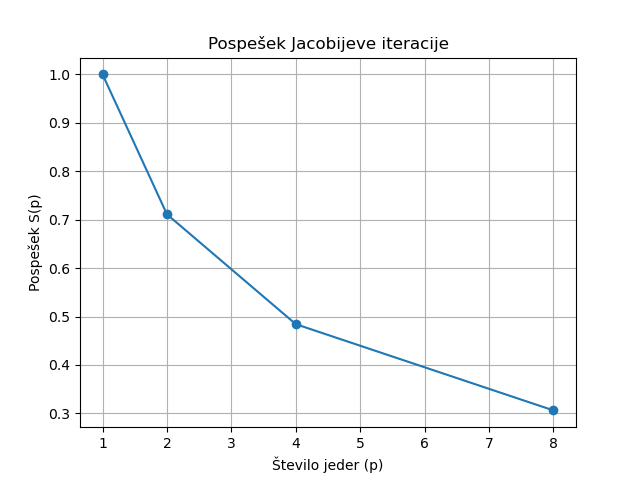
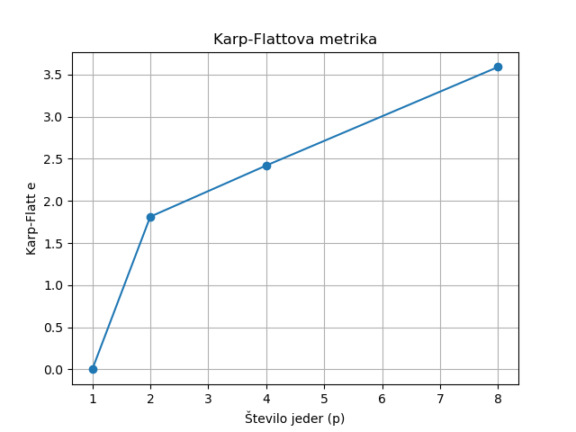
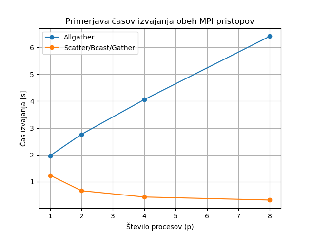
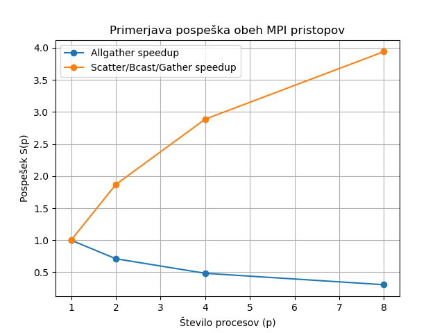

# Paralelizacija Jacobijeve iteracije z uporabo MPI

Projekt implementira Jacobijevo iterativno metodo za reševanje linearnih sistemov Ax = b z uporabo paralelizacije preko knjižnice MPI. Implementirani sta dve različni komunikacijski strategiji, ki omogočata primerjavo učinkovitosti in skalabilnosti.

1. Implementirani pristopi

Allgather pristop (datoteka: jacobi.c)
Vsak proces izračuna svoj del vektorja x. Funkcija MPI_Allgather v vsaki iteraciji zbere vse delne rezultate in jih razpošlje vsem procesom. Prednost pristopa je enostavna implementacija, slabost pa velika količina globalne komunikacije, ki omejuje skalabilnost.

Scatter/Bcast/Gather pristop (datoteka: jakobieva.c)
MPI_Scatter razdeli matriko A in vektor b med procese, MPI_Bcast razpošlje trenutni vektor x vsem procesom, MPI_Gather pa zbere nove delne rezultate na proces 0. Prednost pristopa je manj globalne komunikacije in boljša skalabilnost.

2. Strojna oprema

Testiranje je bilo izvedeno na računalniku z Intel i5‑1135G7 procesorjem, ki ima 4 fizična jedra in 8 logičnih jeder (Hyper‑Threading). Ker sem programe poganjala z več procesi, kot je fizičnih jeder, je bilo potrebno uporabiti parameter --oversubscribe. MPI privzeto ne dovoli zagona več procesov, kot je jeder, zato je ta parameter nujen.

3. Struktura projekta

jacobi.c
jakobieva.c
analiza.py
speedup.png
karp_flatt.png
primerjava_casov.png
primerjava_speedup.png
README.md

4. Kompilacija

mpicc jacobi.c -o jacobi
mpicc jakobieva.c -o jakobieva

5. Zagon

mpirun --oversubscribe -np 4 ./jacobi
mpirun --oversubscribe -np 4 ./jakobieva

Zagon za p = 1, 2, 4, 8:

for p in 1 2 4 8; do
    echo "===== np = $p ====="
    for r in 1 2 3; do
        echo "Run $r:"
        mpirun --oversubscribe -np $p ./jakobieva
    done
done

6. Rezultati

Allgather pristop (jacobi.c)
Čas izvajanja se povečuje z večanjem števila procesov. Pospešek pada. Karp–Flatt metrika kaže velik komunikacijski delež.

Scatter/Bcast/Gather pristop (jakobieva.c)
Čas izvajanja se zmanjšuje z večanjem števila procesov. Skalabilnost je boljša. Komunikacijski overhead je manjši.

Diagrami:

7. Zaključek

Druga implementacija (Scatter/Bcast/Gather) je učinkovitejša od Allgather pristopa. Zmanjšuje globalno komunikacijo, bolje izkorišča paralelizacijo in dosega boljše časovne rezultate.
Lahko si tudi ogledate Word dokument ki ima bolj opširno razlago.

